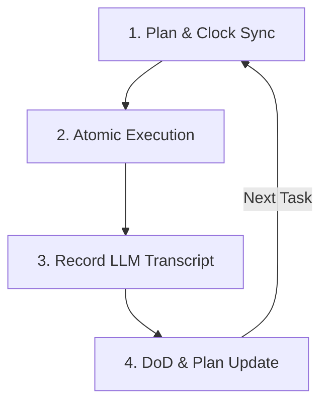

# Bob Agentic Workflow (`AGENTS.md`)

This document defines the agentic workflow, coding standards, and project maintenance protocols for **Bob** (and other LLM assistants) when working on the **AAP + HCP Vault OIDC Integration Pattern** repository.

---

## 1. Project Overview & Context

- **Goal:** Build an integration pattern showcasing **Red Hat Ansible Automation Platform (AAP) 2.7** OIDC workload identity with **HCP Vault** for KV secrets engine v2 retrieval.
- **Key Architecture Rule:** The repository separates bootstrap/connection-point setup from runtime execution:
  - **Vault Configuration:** Idempotent shell scripts using `vault` CLI (`vault/scripts/`).
  - **AAP Configuration:** Instructional guides and credential field mappings (`aap/`).
  - **Runtime Demonstration:** Ansible playbooks utilizing OIDC-resolved credentials (`examples/`).
- **Core Principles:** Keep connection-point details configurable (`config/env.example`), avoid hardcoded credentials, and use short-lived JWT-based authentication.

---

## 2. Daily Work Cycle for Bob

Every conversation session and task execution must follow this rigorous 4-step loop:



### Step 1: Plan & Clock Sync
1. **Sync Time:** Run `date +%Y-%m-%d` to get today's local date (Principle P16). Never infer dates from training data or conversation history.
   > **Bob tool:** `execute_command` → `date +%Y-%m-%d`
2. **Read Current State:** Read `.github/.agents/plan.md` and check the list of tasks.
   > **Bob tool:** `read_file` → `.github/.agents/plan.md`
3. **Read Open Tasks:** Read `TODO.md` for any outstanding items not yet in a plan sub-task.
   > **Bob tool:** `read_file` → `TODO.md`
4. **Synchronize:** Check git status and workspace structure to verify which tasks are truly pending or completed.
   > **Bob tool:** `execute_command` → `git status`

### Step 2: Atomic Execution Loop
1. **Select One Task:** Identify the next `pending` task in `.github/.agents/plan.md`. Never multi-task or implement multiple sub-tasks in a single pass.
2. **No Speculation:** Read all relevant files and schemas before editing. If implementing a script or template, read any existing scripts, configs, or reference docs in the workspace first.
3. **Minimize Changes:** Implement the absolute minimal, simplest code to solve the sub-task. Follow existing patterns, directories, and naming conventions.
4. **Configurability:** Ensure all integration parameters (e.g., URLs, paths, roles) are sourced dynamically from `config/env.example` or equivalent environment variables. Never hardcode them.

### Step 3: Record LLM Transcript (P13)
Before committing the code, write the session transcript to a file in `.llm/`:
- **Path:** `.llm/YYYY-MM-DD-<short-topic-slug>.md`
- **Content:** Detail the date, the LLM engine/tool used, the prompt(s), the key changes made, and a reference to the upcoming commit message.
   > **Bob tool:** `write_file` with the full transcript content. Do **not** use shell commands (`cat`, `tee`, `echo`) — Bob's `write_file` requires no additional permissions and is the correct tool for creating transcript files.

### Step 4: Definition of Done (DoD) & Plan Update
Verify that the task is fully complete according to the Definition of Done:
- [ ] No hardcoded customer names, identifiers, or real secrets are present (P14).
- [ ] Any script or config preserves existing user data and uses additive operations (P15).
- [ ] Code files (especially scripts/playbooks) are clean, under 300 lines, and contain no TODOs without action items.
- [ ] Update `.github/.agents/plan.md`: change the task status to `completed` using precise edits. Preserve all other text and formatting in the plan.
- [ ] **Capture new work:** If any outstanding or follow-on tasks were identified during this session, add them to `TODO.md` before committing. Use `apply_diff` to append — do not overwrite existing entries.
   > **Bob tool:** `apply_diff` → `TODO.md` (append new `- [ ]` items under the appropriate section)

---

## 3. Atomic Commit Conventions

Every sub-task must be committed individually at the end of its execution loop. Never bundle multiple tasks into one commit.

### Format
Follow **Conventional Commits** format:
```
<type>(<scope>): <short imperative present-tense summary>

[Optional body: explain the WHY, not the WHAT]

Transcript: .llm/YYYY-MM-DD-<topic>.md
```

### Allowed Types
- `feat`: New scripts, configurations, or playbooks.
- `fix`: Corrections to existing scripts, configs, or playbooks.
- `docs`: Documentation updates (README, `docs/`, inline comments).
- `chore`: Tooling, formatting, pre-commit hook scripts, file scaffolding.

### Example Commits
- `feat(vault): implement jwt auth configuration script`
- `docs(readme): draft SCQA situation and complication`
- `fix(examples): correct environment variable lookup in playbook`

---

## 4. Project Maintenance Protocols

### Secrets & Identity Safety (P14)
- **Zero Real Secrets:** Never write real Vault tokens, passwords, private keys, or actual cluster URLs to code files, scripts, or documentation.
- **Anonymization:** Always use placeholder domains (e.g., `aap.example.com`) and local variable expansions.
- **Validation:** When writing scripts, include validation checks (e.g., `99-verify-vault-config.sh`) that fail loudly if connection settings are incomplete.

### Data & Code Integrity (P15)
- **No Destructive Overwrites:** Scripts and helpers must never silently overwrite or truncate existing files or configurations that contain user edits. Use additive updates (append, merge) and verify file existence first.
- **File Length Control:** Keep templates, playbooks, and scripts under 300 lines. If a script starts growing, refactor it into clean, modular functions or sub-scripts.

### Automated Checks Enforcement
Whenever editing code, ensure these mechanisms are respected:
- **Pre-commit hook (`scripts/hooks/pre-commit.sh`):** Formats, lints, and checks for secrets before any commit can be accepted.
- **Commit-msg hook (`scripts/hooks/commit-msg.sh`):** Reminds the assistant to ensure an LLM transcript has been stored under `.llm/` and referenced.
