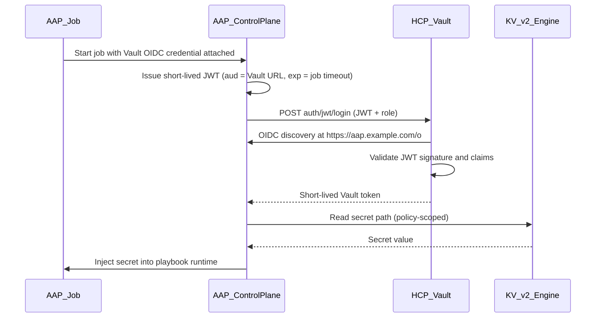

# AAP + HCP Vault OIDC Integration Pattern

**Target repo:** [`/Users/joani.delaporte/advarch-ansible/ansible_oidc_vault`](/Users/joani.delaporte/advarch-ansible/ansible_oidc_vault) (currently empty except [`.github/copilot-instructions.md`](/Users/joani.delaporte/advarch-ansible/ansible_oidc_vault/.github/copilot-instructions.md))

**Primary reference:** [Red Hat AAP 2.7 — OIDC authentication for HashiCorp Vault](https://docs.redhat.com/en/documentation/red_hat_ansible_automation_platform/2.7/whats_new-oidc_authentication_for_hashicorp_vault)

**Scope decisions (confirmed):**
- Working example: **HashiCorp Vault Secret Lookup (OIDC)** with **KV secrets engine v2**
- Vault-side config: **shell scripts** using `vault` CLI
- **No platform deployment** — document and script only the integration connection points

---

## Integration architecture

AAP 2.7 acts as the **OIDC identity provider**; Vault trusts AAP-issued JWTs via its **JWT auth method** and returns short-lived Vault tokens scoped by policy.



**Critical alignment points** (from [Configure the HashiCorp Vault server](https://docs.redhat.com/en/documentation/red_hat_ansible_automation_platform/2.7/whats_new-configure_the_hashicorp_vault_server) and [Create a Vault OIDC credential](https://docs.redhat.com/en/documentation/red_hat_ansible_automation_platform/2.7/whats_new-create_a_credential_using_a_vault_oidc_credential_type)):

| Connection point | Value / rule |
|---|---|
| AAP OIDC discovery URL | `https://<aap-host>/o` |
| AAP feature flag | `FEATURE_OIDC_WORKLOAD_IDENTITY_ENABLED=True` (install-time) |
| Vault JWT config | `oidc_discovery_url` → AAP `/o` endpoint |
| Vault JWT role `bound_audiences` | Must **exactly match** AAP credential **Server URL** (HCP cluster URL, e.g. `https://xxx.hashicorp.cloud:8200`) |
| Vault JWT role `user_claim` | `sub` |
| AAP credential auth path | Default `jwt` unless custom mount |
| KV API version in credential | `v2` |

---

## Repository structure

```
ansible_oidc_vault/
├── README.md                          # SCQA narrative + quick start + architecture
├── docs/
│   ├── prerequisites.md               # Pre-existing platform requirements
│   ├── aap-configuration.md           # Feature flag + credential + job template
│   ├── vault-configuration.md         # HCP Vault JWT/KV/policy setup
│   ├── validation.md                  # Step-by-step test checklist
│   └── troubleshooting.md             # Common misconfigurations
├── config/
│   └── env.example                    # All overridable connection variables
├── vault/
│   ├── policies/
│   │   └── aap-kv-read.hcl
│   ├── scripts/
│   │   ├── 00-enable-jwt-auth.sh
│   │   ├── 01-configure-jwt-oidc.sh
│   │   ├── 02-create-jwt-role.sh
│   │   ├── 03-write-kv2-secret.sh
│   │   └── 99-verify-vault-config.sh
│   └── README.md                      # Vault-side run order and HCP notes
├── aap/
│   ├── credential-fields.example.yaml # Documented field mapping for UI setup
│   └── job-template-checklist.md      # Attach credential + test external credential
├── examples/
│   └── kv2-secret-lookup/
│       ├── playbook.yml               # Minimal playbook consuming injected secret
│       └── job-template-notes.md      # How secret appears at runtime
└── scripts/
    └── smoke-test.sh                  # Optional local preflight (env vars, vault status)
```

Keep the separation already described in copilot instructions: **Vault config**, **AAP config docs**, and **runtime demo playbook** in distinct directories.

---

## Sub-tasks

---

### scaffold-repo

**Intent:** Create the directory skeleton, `config/env.example` (single source of truth for all connection variables), and empty placeholder files so subsequent tasks have a stable structure to fill in.

**Expected Outcomes:**
- All directories and stub files listed in the repository structure above exist in the target repo.
- `config/env.example` contains all variables from the code example below with inline comments.
- No secrets or real URLs are present — only placeholder values.

**Todo List:**
1. Read `.github/copilot-instructions.md` in the target repo for any constraints.
2. Create directory tree: `docs/`, `config/`, `vault/policies/`, `vault/scripts/`, `aap/`, `examples/kv2-secret-lookup/`, `scripts/`.
3. Write `config/env.example` from the template in "Code examples" §1 below.
4. Create empty stub files: `vault/policies/aap-kv-read.hcl`, `vault/README.md`, `aap/credential-fields.example.yaml`, `aap/job-template-checklist.md`, `examples/kv2-secret-lookup/job-template-notes.md`, `scripts/smoke-test.sh`.
5. Verify file count and structure with `find . -not -path './.git/*' | sort`.

**Relevant Context:**
- Target repo: `/Users/joani.delaporte/advarch-ansible/ansible_oidc_vault`
- `config/env.example` template: see "Code examples §1" section below
- Repository structure diagram above

**Status:** `[ ] pending`

---

### vault-scripts

**Intent:** Implement the five ordered Vault shell scripts and the HCL policy so an operator can run them sequentially to fully configure Vault for AAP OIDC JWT auth and seed the demo KV v2 secret.

**Expected Outcomes:**
- Scripts `00` through `03` and `99` are complete, executable, and use `set -euo pipefail`.
- Each script sources `config/env.example` (or a user `.env`) for all variables — no hardcoded values.
- `99-verify-vault-config.sh` exits non-zero if any config is missing or mismatched.
- `vault/policies/aap-kv-read.hcl` grants least-privilege read on the demo path only.
- Running `99` after `00–03` prints a summary of all connection point values the operator must copy into AAP.

**Todo List:**
1. Read `config/env.example` to confirm variable names.
2. Write `vault/policies/aap-kv-read.hcl` from template in "Code examples §2" below.
3. Write `vault/scripts/00-enable-jwt-auth.sh` — enable JWT auth method (idempotent).
4. Write `vault/scripts/01-configure-jwt-oidc.sh` — configure OIDC discovery URL.
5. Write `vault/scripts/02-create-jwt-role.sh` — write policy + JWT role.
6. Write `vault/scripts/03-write-kv2-secret.sh` — enable KV v2 if needed; write demo secret.
7. Write `vault/scripts/99-verify-vault-config.sh` — read back config, role, secret; print AAP field values.
8. Write `vault/README.md` — run order, HCP Vault namespace note, smoke-test reference.
9. Set executable bit: `chmod +x vault/scripts/*.sh scripts/smoke-test.sh`.

**Relevant Context:**
- Script purpose table: see "Code examples §3" below
- Variable names sourced from `config/env.example`
- HCP Vault requires `VAULT_NAMESPACE=admin` header on all API calls

**Status:** `[ ] pending`

---

### scqa-readme

**Intent:** Write the primary README using the SCQA narrative framework so readers understand the problem, the solution, and exactly where to start — with a working architecture diagram and links into `docs/` and `vault/scripts/`.

**Expected Outcomes:**
- `README.md` follows the Situation / Complication / Question / Answer outline from below.
- Architecture section includes the mermaid sequence diagram from this plan.
- Integration highlights table covers all 7 points from "Documentation depth" below.
- Quick start section links to `docs/prerequisites.md`, `vault/scripts/`, `aap/`, and `examples/`.
- All placeholder values (no real URLs or tokens).

**Todo List:**
1. Read existing `README.md` in target repo (if any) to avoid overwriting user content.
2. Write `README.md` following the SCQA outline below.
3. Write `docs/prerequisites.md` — platform requirements (AAP 2.7+, Vault 1.9+, network).
4. Write `docs/aap-configuration.md` — feature flag, credential type, job template steps.
5. Write `docs/vault-configuration.md` — JWT auth setup, policy, role, KV v2 path semantics.
6. Write `docs/troubleshooting.md` — common misconfigurations (audience mismatch, CA trust, path errors).
7. Write `docs/validation.md` — copy the 5-phase validation checklist from this plan.

**Relevant Context:**
- SCQA outline: see "README — SCQA outline" section below
- Integration highlights: see "Documentation depth" section below
- Validation phases A–E: see "Validation plan" section below

**Status:** `[ ] pending`

---

### aap-docs

**Intent:** Add the two AAP-side artifacts that document exactly what values to enter in the AAP UI for the credential and job template, since AAP configuration cannot be scripted in this pattern.

**Expected Outcomes:**
- `aap/credential-fields.example.yaml` maps every AAP credential field to its source variable with inline documentation.
- `aap/job-template-checklist.md` provides a numbered checklist covering credential attachment, **Test external credential**, and job launch.

**Todo List:**
1. Read `config/env.example` for canonical variable names.
2. Write `aap/credential-fields.example.yaml` — credential type, Server URL, Path to auth, Role, API version, KV path fields (see "Code examples §4" below).
3. Write `aap/job-template-checklist.md` — steps: attach credential, run Test external credential, inspect claims, launch job, confirm output.

**Relevant Context:**
- Code examples §4 below — credential field mapping
- `config/env.example` — variable source of truth
- AAP credential type: `HashiCorp Vault Secret Lookup (OIDC)`

**Status:** `[ ] pending`

---

### example-playbook

**Intent:** Add a minimal Ansible playbook that demonstrates how the OIDC-resolved secret is available at runtime, making the "last mile" injection of the secret visible and testable.

**Expected Outcomes:**
- `examples/kv2-secret-lookup/playbook.yml` reads the injected secret variable and prints the key names (not values) confirming retrieval.
- `examples/kv2-secret-lookup/job-template-notes.md` explains how the credential injects the secret and what variable name to expect.
- Playbook uses `no_log: true` on any task that touches the secret value.

**Todo List:**
1. Read AAP docs reference for the injected variable name used by `HashiCorp Vault Secret Lookup (OIDC)` credentials.
2. Write `examples/kv2-secret-lookup/playbook.yml` — capture injected variable, validate it is set, debug key names only.
3. Write `examples/kv2-secret-lookup/job-template-notes.md` — job template settings, expected output, what the credential injects.

**Relevant Context:**
- Code examples §5 below — runtime example guidance
- `aap/credential-fields.example.yaml` — credential field reference

**Status:** `[ ] pending`

---

### validation-run

**Intent:** Execute the full validation checklist against a temporary AAP 2.7 and HCP Vault instance, document the actual results, and capture any real failure modes in `docs/troubleshooting.md`.

**Expected Outcomes:**
- `docs/validation.md` is filled in with pass/fail results for all phases A–E.
- `docs/troubleshooting.md` includes at least the failures encountered during validation.
- `README.md` updated with tested versions (AAP build, HCP Vault cluster type).
- All real tokens and URLs removed or replaced with placeholders before commit.

**Todo List:**
1. Run `scripts/smoke-test.sh` as a preflight check.
2. Execute Vault scripts `00` through `03`, then `99` — record output.
3. Configure AAP credential using `aap/credential-fields.example.yaml` — run **Test external credential**.
4. Create job template, attach credential, launch demo playbook — confirm secret retrieval.
5. Record results in `docs/validation.md` (phases A–E).
6. Add any real failure modes to `docs/troubleshooting.md`.
7. Strip all real tokens/URLs from committed files.
8. Update README tested-versions note.

**Relevant Context:**
- Validation phases A–E: see "Validation plan" section below
- `scripts/smoke-test.sh` — preflight

**Status:** `[ ] pending`

---

## Code examples to implement

### 1. Config template — `config/env.example`

Single source of truth for connection variables (no secrets committed):

```bash
# AAP
AAP_URL=https://aap.example.com
AAP_OIDC_DISCOVERY_URL=${AAP_URL}/o

# HCP Vault
VAULT_ADDR=https://your-cluster.hashicorp.cloud:8200
VAULT_NAMESPACE=                    # blank unless Enterprise namespace
VAULT_TOKEN=                        # admin token for one-time setup only

# JWT auth
VAULT_JWT_AUTH_PATH=jwt
VAULT_JWT_ROLE=aap-kv-read

# KV v2 demo secret
KV_MOUNT=secret
KV_SECRET_PATH=demo/aap-oidc
KV_SECRET_KEY=password
```

### 2. Vault policy — `vault/policies/aap-kv-read.hcl`

Least-privilege read on the demo path only:

```hcl
path "secret/data/demo/aap-oidc" {
  capabilities = ["read"]
}
```

### 3. Vault setup scripts (ordered, idempotent where possible)

| Script | Purpose |
|---|---|
| `00-enable-jwt-auth.sh` | `vault auth enable -path=jwt jwt` (skip if exists) |
| `01-configure-jwt-oidc.sh` | `vault write auth/jwt/config oidc_discovery_url=...` (+ optional `oidc_discovery_ca_pem` if AAP uses private CA) |
| `02-create-jwt-role.sh` | Write policy + JWT role with `role_type=jwt`, `bound_audiences=${VAULT_ADDR}`, `user_claim=sub`, `policies=aap-kv-read` |
| `03-write-kv2-secret.sh` | Enable KV v2 if needed; write demo secret |
| `99-verify-vault-config.sh` | Read back auth config, role, and secret; exit non-zero on mismatch |

Scripts should `source config/env.example` (or user-provided `.env`), use `set -euo pipefail`, and print the exact values operators must copy into AAP credential fields.

### 4. AAP configuration artifacts — `aap/`

Because AAP setup is UI/API-driven and we are not deploying AAP:

- **`credential-fields.example.yaml`** — maps each AAP credential field to repo variables:
  - Credential type: `HashiCorp Vault Secret Lookup (OIDC)`
  - Server URL → `VAULT_ADDR`
  - Path to auth → `VAULT_JWT_AUTH_PATH`
  - JWT role → `VAULT_JWT_ROLE`
  - API version → `v2`
  - Name of secret backend, path to secret, key name → KV variables
- **`job-template-checklist.md`** — steps to attach credential, use **Test external credential**, inspect returned JWT claims, and run a job.

### 5. Runtime example — `examples/kv2-secret-lookup/playbook.yml`

Minimal playbook that uses the injected secret (e.g., `lookup('env', 'ANSIBLE_VAULT_SECRET')` or the credential-injected variable name documented by AAP for Secret Lookup credentials). Keep it explicit so readers see **where** the secret enters the play after OIDC auth completes in the control plane.

---

## README — SCQA outline

Draft the README as the primary deliverable using this structure:

### Situation
- Enterprises run Ansible Automation Platform for infrastructure automation and HCP Vault as centralized secrets management.
- Today, AAP-to-Vault integrations often rely on **long-lived static credentials** stored in AAP, creating rotation burden and standing-privilege risk.
- AAP 2.7 introduces OIDC workload identity so AAP can act as the trust anchor for Vault authentication.

### Complication
- Static Vault tokens/passwords in AAP credentials are hard to rotate, easy to over-scope, and violate zero-trust principles.
- Misaligned JWT configuration (`bound_audiences`, discovery URL, CA trust) causes opaque auth failures at job runtime.
- Teams need a **repeatable, tested pattern** that connects existing AAP and HCP Vault instances without redeploying either platform.

### Question
How do we configure AAP and HCP Vault so automation jobs authenticate to Vault via OIDC and retrieve KV v2 secrets with short-lived, job-scoped identity — without storing Vault credentials in AAP?

### Answer (pattern summary)
- Enable OIDC workload identity on AAP (`FEATURE_OIDC_WORKLOAD_IDENTITY_ENABLED`).
- Configure Vault JWT auth to trust AAP's OIDC discovery endpoint (`/o`).
- Create a Vault JWT role and least-privilege KV v2 read policy.
- Create an AAP **HashiCorp Vault Secret Lookup (OIDC)** credential and validate via **Test external credential**.
- Attach the credential to a job template; run the example playbook to confirm secret retrieval.

Follow Answer with **Architecture**, **Integration highlights**, and **Quick start** sections linking to `docs/` and `vault/scripts/`.

---

## Documentation depth (integration highlights)

Call out these components explicitly in README and `docs/`:

1. **AAP OIDC IdP (`/o`)** — Vault discovers AAP signing keys here; network path from HCP Vault to AAP must be reachable.
2. **JWT auth mount** — default `jwt`; custom paths require matching AAP credential **Path to auth**.
3. **Audience binding** — `bound_audiences` on Vault role must match AAP **Server URL** exactly (common failure point for HCP URLs with port).
4. **Token lifetime** — JWT TTL follows job timeout (default ~5 min + skew); relevant for long-running jobs ([OIDC credential types doc](https://docs.redhat.com/en/documentation/red_hat_ansible_automation_platform/2.7/whats_new-oidc_credential_types_for_hashicorp_vault)).
5. **KV v2 path semantics** — API path `secret/data/...` vs mount `secret`.
6. **CA trust** — if AAP uses a private CA, include `oidc_discovery_ca_pem` in JWT config script variant.
7. **Claims-based policy (future)** — note that Vault policies can later use JWT claims for finer scope ([claims doc](https://docs.redhat.com/en/documentation/red_hat_ansible_automation_platform/2.7/whats_new-claims_for_workload_identity)); initial pattern uses a fixed demo policy.

---

## Validation plan (temporary platform access)

Execute in order; record results in `docs/validation.md`:

### Phase A — Preconditions
- [ ] Confirm AAP 2.7+ with `FEATURE_OIDC_WORKLOAD_IDENTITY_ENABLED=True`
- [ ] Confirm OIDC discovery resolves: `curl -s ${AAP_URL}/o/.well-known/openid-configuration`
- [ ] Confirm HCP Vault admin access and `VAULT_ADDR`

### Phase B — Vault-side (scripts)
- [ ] Run `vault/scripts/00` through `03` against HCP Vault
- [ ] Run `99-verify-vault-config.sh` — all checks pass

### Phase C — AAP credential
- [ ] Create **HashiCorp Vault Secret Lookup (OIDC)** credential using `aap/credential-fields.example.yaml`
- [ ] Run **Test external credential** — success with expected claims displayed
- [ ] On failure: check Vault audit log, audience mismatch, auth path, CA trust (document in `troubleshooting.md`)

### Phase D — End-to-end job
- [ ] Create job template with example playbook + Vault OIDC credential
- [ ] Launch job — playbook receives KV v2 secret value
- [ ] Confirm no static Vault token stored in AAP credential

### Phase E — Repo hardening
- [ ] Ensure no real tokens/URLs committed (only `env.example`)
- [ ] Update README with tested versions (AAP build, HCP Vault cluster type)
- [ ] Add `scripts/smoke-test.sh` for preflight checks before live test window

---

## Out of scope (explicitly excluded)

- Deploying or upgrading AAP or HCP Vault
- HashiCorp Vault Signed SSH (OIDC) credential type
- Terraform/IaC for Vault (shell scripts only)
- Dynamic secrets engines, namespaces (unless test environment requires — document as optional `VAULT_NAMESPACE` field)
- SPIFFE/SPIRE or workload-side direct Vault access (mentioned in portfolio CSV as separate future pattern)

---

## Suggested implementation order

1. Scaffold repo structure and `config/env.example`
2. Write Vault HCL policy and ordered shell scripts with verify script
3. Draft SCQA README and supporting `docs/` pages
4. Add AAP credential mapping and job template checklist
5. Add example playbook and job-template notes
6. Run validation against temporary AAP + HCP Vault access; iterate troubleshooting doc from real failures
7. Final README polish with tested connection values redacted as placeholders
