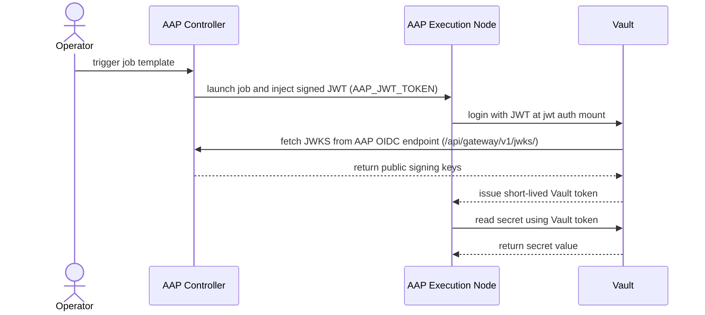

# AAP + HCP Vault OIDC Integration Pattern

**Repo:** [`/Users/joani.delaporte/Bob/aap-vault-oidc-integration`](/Users/joani.delaporte/Bob/aap-vault-oidc-integration)

**Primary reference:** [Red Hat AAP 2.7 — OIDC authentication for HashiCorp Vault](https://docs.redhat.com/en/documentation/red_hat_ansible_automation_platform/2.7/whats_new-oidc_authentication_for_hashicorp_vault)

**Scope decisions (confirmed):**
- Vault-side and AAP-side configuration: **Ansible playbooks** using `community.hashi_vault` and `ansible.builtin.uri` — no shell scripts
- Two Vault deployment models: **self-managed Vault** and **HCP Vault Dedicated** (parallel paths, AAP config shared)
- All playbooks are designed to run as **AAP Job Templates** — not locally
- Credential injection via custom AAP credential types; no secrets in vars files

---

## Actual repository structure

```
aap-vault-oidc-integration/
├── README.md                                    # SCQA narrative, architecture diagrams, integration highlights
├── demo.md                                      # End-to-end step-by-step demo guide (AAP UI walkthrough)
├── AGENTS.md / CODEOWNERS / LICENSE / TODO.md
├── examples/
│   ├── aap-config/
│   │   ├── configure_aap_vault_oidc.yml         # Enable OIDC issuer; create custom cred types + credential instance
│   │   ├── vars.yml
│   │   └── README.md
│   ├── vault-config/
│   │   ├── configure_vault_oidc.yml             # Self-managed Vault: enable JWT auth, policy, role, seed secret
│   │   ├── vars.yml
│   │   └── README.md
│   ├── hcp-vault-config/
│   │   ├── configure_hcp_vault_oidc.yml         # HCP Vault Dedicated variant (adds X-Vault-Namespace header)
│   │   ├── vars.yml
│   │   └── README.md
│   ├── demo-playbook/
│   │   ├── read_vault_secret.yml                # End-to-end demo: AAP JWT → Vault login → KV read (self-managed)
│   │   ├── vars.yml
│   │   └── README.md
│   └── hcp-demo-playbook/
│       ├── read_hcp_vault_secret.yml            # End-to-end demo: AAP JWT → HCP Vault login → KV read
│       ├── vars.yml
│       └── README.md
└── .github/.agents/
    ├── plan.md / agents.md / CONSTITUTION.md / workflow-review-plan.md
    └── bob-instructions.md
```

---

## Integration architecture

AAP 2.7 acts as the **OIDC identity provider**; Vault trusts AAP-issued JWTs via its **JWT auth method** and returns short-lived Vault tokens scoped by policy.



**Critical alignment points:**

| Connection point | Value / rule |
|---|---|
| AAP OIDC discovery URL | `https://<aap-controller-host>/o` — confirmed via `curl -L <host>/o/.well-known/openid-configuration/`; use the `issuer` field value |
| AAP JWKS endpoint | `https://<aap-controller-host>/api/gateway/v1/jwks/` |
| JWT injected env var | `AAP_JWT_TOKEN` (confirm name against live AAP instance) |
| Vault JWT config `oidc_discovery_url` | AAP `issuer` value from `/o/.well-known/openid-configuration/` (typically `https://<aap-host>/o`) |
| Vault JWT role `bound_audiences` | Must **exactly match** `vault_addr` (HCP URL includes port `8200`) |
| Vault JWT role `user_claim` | `sub` |
| HCP Vault namespace | `admin` on all API calls |
| Custom credential type | `HashiCorp Vault JWT` — injects `vault_addr`, `vault_jwt_mount`, `vault_role` as extra vars |

---

## Sub-tasks

---

### scaffold-repo

**Intent:** Create the directory skeleton, all playbooks, vars files, and READMEs for all five example directories plus the root README and demo guide.

**Status:** `[x] completed`

**What was built:**
- `examples/aap-config/` — OIDC issuer enablement + HashiCorp Vault JWT credential type + credential instance; bootstrap credentials via `CONTROLLER_*` env vars
- `examples/vault-config/` — self-managed Vault JWT auth, policy, role, demo secret; bootstrap via `VAULT_TOKEN` env var
- `examples/hcp-vault-config/` — HCP Vault Dedicated variant with namespace headers; bootstrap via `VAULT_TOKEN` env var
- `examples/demo-playbook/` — end-to-end self-managed demo
- `examples/hcp-demo-playbook/` — end-to-end HCP demo
- `README.md` — SCQA narrative, mermaid diagrams, integration highlights table
- `demo.md` — step-by-step AAP UI walkthrough, expected output, troubleshooting table

**Refactor (2026-09-11):** Bootstrap credentials switched from AAP custom credential type injection to environment variables (`VAULT_TOKEN`, `CONTROLLER_HOST/USERNAME/PASSWORD/VERIFY_SSL`). Three bootstrap credential types (Vault Bootstrap Token, HCP Vault Bootstrap Token, AAP Admin Credential) removed from `configure_aap_vault_oidc.yml`. All READMEs and `demo.md` updated to document `export` commands.

---

### validation-run

**Intent:** Execute the full end-to-end flow against a live AAP 2.7 instance and an HCP Vault Dedicated cluster; record pass/fail results; capture real failure modes.

**Expected Outcomes:**
- All five job templates run successfully in order.
- `AAP_JWT_TOKEN` environment variable name confirmed against live AAP instance.
- OIDC issuer enablement endpoint confirmed (`/api/gateway/v1/settings/` vs `/api/v2/settings/system/`).
- Demo playbooks print keys (not values) confirming KV v2 secret retrieval.
- Any real failure modes captured and `demo.md` troubleshooting table updated.
- No real tokens or cluster URLs committed — only placeholder values in `vars.yml` files.

**Todo List:**
1. Confirm `FEATURE_OIDC_WORKLOAD_IDENTITY_ENABLED` is set on the AAP instance.
2. Confirm OIDC issuer is active: `curl -L https://<aap-host>/o/.well-known/openid-configuration/` — should return a valid OIDC discovery document.
3. Run Step 1: add repo as AAP Project.
4. Run Step 2: run `configure_aap_vault_oidc.yml` job template; verify credential types created.
5. Run Step 3A (self-managed) or 3B (HCP): run Vault config job template; verify JWT auth, policy, role, secret.
6. Run Step 4: run demo playbook job template; confirm `Keys found: ['username', 'password']` in output.
7. Confirm `AAP_JWT_TOKEN` is the correct env var name; update playbook comment if different.
8. Update `demo.md` troubleshooting table with any new failure modes encountered.
9. Strip all real tokens/cluster URLs before committing; replace with placeholder values.

**Relevant Context:**
- `demo.md` — full step-by-step UI walkthrough
- `examples/aap-config/README.md` — OIDC issuer endpoint caveat
- `examples/demo-playbook/README.md` / `examples/hcp-demo-playbook/README.md` — expected output

**Status:** `[ ] pending`

---

### post-validation-polish

**Intent:** After validation, make any corrections and final quality pass before publishing.

**Expected Outcomes:**
- `README.md` updated with tested versions (AAP build number, HCP Vault cluster tier).
- Any placeholder notes (e.g., `AAP_JWT_TOKEN — confirm during testing`) updated with confirmed values.
- `demo.md` troubleshooting table reflects real failure modes from validation.
- All files under 300 lines; no TODO comments without action items.
- Conventional commit created with `.llm/` transcript referenced.

**Todo List:**
1. Update `README.md` with confirmed AAP and Vault versions tested against.
2. Resolve any `NOTE:` / `IMPORTANT:` / `⚠️` callouts that are no longer uncertain after testing.
3. Review line counts on all playbooks and READMEs; refactor if over 300 lines.
4. Final secrets scan: confirm no real tokens, URLs, or credentials in any committed file.
5. Write `.llm/` transcript and commit.

**Status:** `[ ] pending`

---

## Out of scope (explicitly excluded)

- Shell scripts for Vault configuration (replaced by Ansible playbooks)
- `config/env.example` single-file variable store (replaced by per-example `vars.yml` files)
- `vault/` and `aap/` top-level directories from original plan (replaced by `examples/` structure)
- Deploying or upgrading AAP or HCP Vault
- HashiCorp Vault Signed SSH (OIDC) credential type
- Terraform/IaC for Vault
- Dynamic secrets engines
- SPIFFE/SPIRE or workload-side direct Vault access
