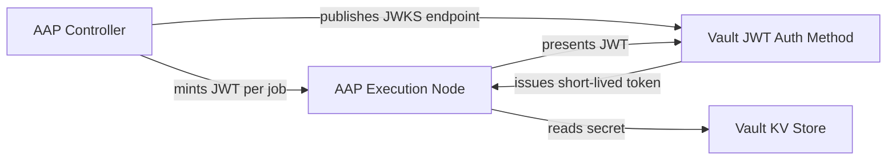
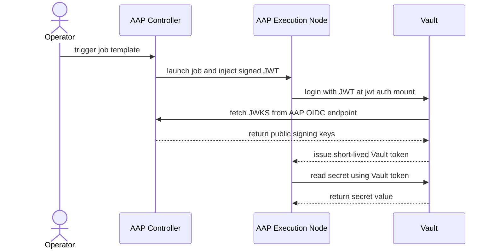

# AAP + Vault OIDC Integration Pattern

Secretless, identity-based authentication between Ansible Automation Platform 2.7 and self-managed HashiCorp Vault — no static credentials required.

---

## SCQA

**Situation**

Enterprises running Ansible Automation Platform alongside HashiCorp Vault today manage static tokens or AppRole secrets to allow automation jobs to retrieve credentials. This is a well-understood model: a credential is created once, stored in AAP, and injected into job runs whenever a playbook needs to reach Vault. The pattern works, and most teams have built reliable processes around it.

**Complication**

Static credentials introduce risks that compound over time. Tokens and AppRole secrets must be rotated, tracked, and audited individually — creating sprawl as the number of job templates and Vault paths grows. Rotation gaps create windows of exposure. Shared secrets make it impossible to attribute a Vault access event to a specific job run or operator. These characteristics directly conflict with zero-trust principles, and regulatory frameworks increasingly require per-request, non-reusable credentials. AAP 2.7 introduces a built-in OIDC provider capability that renders static secrets between AAP and Vault entirely unnecessary.

**Question**

How can teams adopt secretless, identity-based authentication between AAP and Vault without re-architecting their existing automation?

**Answer**

AAP 2.7's built-in OIDC issuer mints a short-lived, cryptographically signed JWT token for every job run. Vault's native JWT/OIDC auth method is configured once to trust AAP as the issuer. From that point on, every automation job authenticates to Vault using its own ephemeral token — scoped to that job, valid for minutes, and fully auditable. No static secrets are stored anywhere in the pipeline.

---

## Prerequisites

- **Ansible Automation Platform 2.7+** (self-managed; provides the built-in OIDC issuer)
- **HashiCorp Vault 1.9+** (self-managed; uses the native JWT/OIDC auth method)
- **`community.hashi_vault` collection >= 6.x** (provides `vault_login`, `vault_read`, and related modules)
- **Network reachability** from AAP execution nodes to the Vault API endpoint, and from Vault to AAP's JWKS endpoint for token validation

---

## Architecture

AAP 2.7 acts as the OIDC **provider**: its built-in issuer exposes a JWKS endpoint that publishes the public keys used to sign per-job JWT tokens. Vault is configured as the **relying party**: its JWT auth method mount is pointed at AAP's OIDC discovery URL, fetches the JWKS keys, and uses them to validate incoming tokens. The two platforms share no long-lived secret — the trust relationship is established entirely through public-key cryptography.

When a job template runs, the AAP Controller injects a signed JWT into the execution environment. The playbook presents that token to Vault, which validates it against the live JWKS endpoint and — if the token's claims satisfy the configured role — issues a short-lived Vault token scoped to the allowed secret paths.

---

## Authentication Flow

The sequence below traces a single job run from operator trigger through to secret retrieval. The critical steps are the JWT minting by AAP and the JWKS validation by Vault — the exchange that eliminates any static credential.

---

## Integration Highlights

| Component | Detail |
|---|---|
| **AAP OIDC Issuer URL** | `https://<aap-controller-host>/api/gateway/v1/jwt/` — the `iss` claim in every minted JWT; configure this as `oidc_discovery_url` in Vault |
| **AAP JWKS Endpoint** | `https://<aap-controller-host>/api/gateway/v1/jwks/` — Vault fetches public keys from this URL to verify JWT signatures |
| **Vault JWT auth mount** | Enabled at a configurable path (default `jwt/`); receives `vault write auth/jwt/login role=<role> jwt=<token>` calls from playbooks |
| **JWT role — `user_claim`** | Map to `sub` (AAP sets this to the job's identity); used as the Vault entity alias |
| **JWT role — `bound_claims`** | Restrict which AAP jobs can authenticate: bind on `aud` (audience set to the Vault address) and optionally on AAP-specific claims such as `org`, `project`, or `job_template_id` to enforce least-privilege |
| **Vault policy** | Scope each JWT role to the minimum required KV paths (`read` only); never attach a broad admin policy to a job-facing role |
| **Token TTL** | Set `token_ttl` on the JWT role to a short value (e.g. `300s` / 5 minutes); tokens expire automatically, limiting the blast radius of any leaked token |

---

## Usage / Quick Start

1. **Configure Vault** — enable the JWT auth method, create the role, and seed the demo secret:
   see [`examples/vault-config/`](examples/vault-config/)

2. **Configure AAP** — enable the OIDC issuer and set up the Vault credential type in AAP:
   see [`examples/aap-config/`](examples/aap-config/)

3. **Run the demo** — import and execute the end-to-end demonstration playbook as an AAP job template:
   see [`examples/demo-playbook/`](examples/demo-playbook/)

---

## References

- [AAP 2.7 — What's New: OIDC Authentication for HashiCorp Vault](https://docs.redhat.com/en/documentation/red_hat_ansible_automation_platform/2.7/whats_new-oidc_authentication_for_hashicorp_vault)
- [HashiCorp Vault — JWT/OIDC Auth Method](https://developer.hashicorp.com/vault/docs/auth/jwt)
- [Ansible `community.hashi_vault` Collection](https://docs.ansible.com/ansible/latest/collections/community/hashi_vault/)
